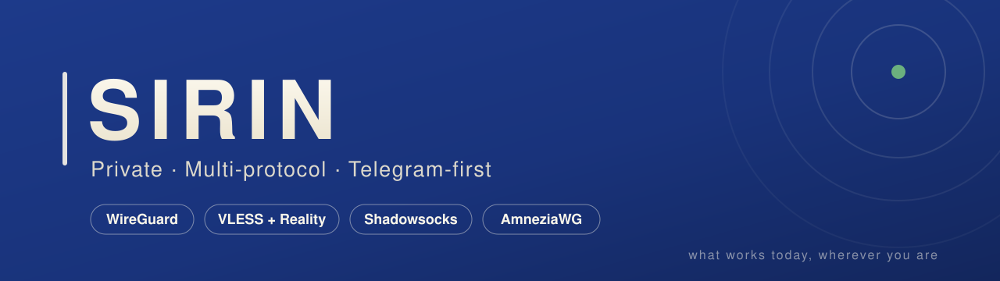
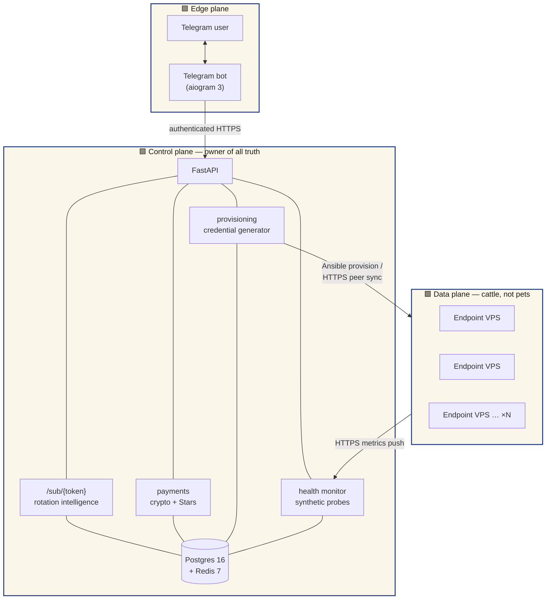
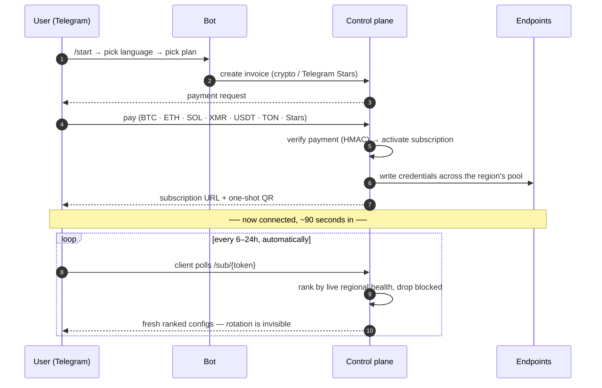

<!-- markdownlint-disable MD033 MD041 -->
<div align="center">



<br/>

**A private, multi-protocol VPN that lives inside a Telegram bot.**
Automatic protocol rotation across WireGuard, AmneziaWG, VLESS + Reality and Shadowsocks —
*what works today, wherever you are.*

<br/>

[](https://sirin.one)
[](#-protocols)
[](#-privacy-posture)
[](#-how-it-works)

[](https://t.me/getsirin_bot)
[](https://sirin.one)
[](https://sirin.one/canary)
[](#-license)

</div>

---

> **The internet was supposed to be borderless.** For the people who actually work on it,
> it no longer is. Sirin is a quiet tool for people who need the internet to work — in both
> directions, without asking permission. We don't log your activity. We don't sell your
> data, because we don't have your data to sell. We won't promise absolutes — no product
> that claims 100% is telling the truth. What we promise is to tell you honestly what works,
> what doesn't, and what changed.
>
> *The internet should just be. — [Read the full manifesto →](./MANIFESTO.md)*

---

## ✦ Why Sirin is different

Every other VPN hands you a static config and, when the filters escalate, a support
ticket to get a new one. **Sirin's wedge is that rotation is automatic and invisible.**

The product you own is not a config file — it's a single long-lived **subscription URL**.
Your client polls it on its own schedule; Sirin returns the configs that are *actually
passing the filters in your region right now*, ranked by live health. When a protocol or
an endpoint gets blocked, the next poll quietly routes you around it. You never re-import.
You never open a ticket.

```text
   ┌─────────────┐     poll every 6–24h      ┌────────────────────────┐
   │ your client │ ───────────────────────▶  │  GET /sub/{your-token} │
   │ (v2rayNG,   │                            │  → best configs for    │
   │  AmneziaVPN)│ ◀───────────────────────  │    your region, ranked │
   └─────────────┘     fresh ranked configs   │    by live health      │
                                              └────────────────────────┘
```

---

## ✦ Protocols

Four protocols, because a single one is a single point of failure against deep packet
inspection. Every active user holds credentials for all four; the service rotates between
them automatically.

| Protocol | What it is | Why it's in the deck |
| --- | --- | --- |
| **WireGuard** | Modern, fast, lean kernel-level tunnel | The baseline — best latency and battery when it isn't being filtered |
| **AmneziaWG** | WireGuard with tunable traffic obfuscation | Survives DPI that fingerprints vanilla WireGuard handshakes; the heavy-filter workhorse |
| **VLESS + Reality** | Xray transport that borrows a real TLS handshake | Looks like ordinary traffic to a plausible site — hard to classify, hard to block without collateral |
| **Shadowsocks** | Lightweight encrypted SOCKS proxy (2022 edition) | Small footprint, broad client support, a reliable fallback when the others are under pressure |

> Clients stay third-party and standard — v2rayNG, Clash, AmneziaVPN, any subscription-aware
> app. Sirin is the brain, not another app to trust.

---

## ✦ Architecture

Three planes, strictly separated. Endpoints never talk to users, never see billing, and
hold no state that can't be rebuilt from the control plane.



**Inter-plane rules (non-negotiable):**

- Edge → Control: authenticated HTTPS only.
- Control → Endpoints: provisioning push + runtime peer sync. Endpoints **pull**, never decide.
- Endpoints → Control: anonymous health metrics only — no user identifiers ever leave on this path.
- **Never:** an endpoint talking to Telegram, talking to a user, or knowing anything about billing.

📐 Full sanitized write-up in **[docs/architecture.md](./docs/architecture.md)**.

---

## ✦ How it works — first connection to staying connected



---

## ✦ Privacy posture

Privacy isn't a setting in Sirin — it's the architecture. **You cannot leak what you never
held.** Here's the entire list of what we keep on a user:

| We store | We deliberately **never** store |
| --- | --- |
| Telegram ID (the account boundary) | Email · name · phone · postal address |
| Encrypted subscription token | Raw IP address · device fingerprint · user-agent |
| Encrypted protocol credentials | Per-user browsing or connection activity logs |
| Coarse region (country-level, for routing) | Card / bank details — crypto + Stars only |

- **No PII, by policy and by schema review at every migration.** A pull request that adds an
  identifying field is rejected by default. *(see [docs/privacy.md](./docs/privacy.md))*
- **Encrypted at rest.** Credentials and tokens are encrypted at the application layer before
  they ever touch the database; the key lives in process memory, never in a backup.
- **Short memory.** Raw health signals are deleted after 7 days; only anonymous aggregates
  (no user ID) are kept to drive rotation.
- **Independent operator, no central legal domicile.** Privacy is a product-level guarantee
  enforced by what we built — not a promise that depends on a jurisdiction.
- **Verifiable.** A signed [warrant canary](https://sirin.one/canary) is published and
  refreshed on a schedule. If it stops being signed, assume the worst.

---

## ✦ Threat model, in brief

Sirin is built for users who, by definition, have adversarial counterparties — so the
design assumes a capable one.

| Adversary | What they want | How Sirin holds up |
| --- | --- | --- |
| **State-level DPI** | Fingerprint & block protocols; deanonymize by traffic analysis | Four protocols + automatic rotation; obfuscated transports; no single protocol to kill |
| **Server seizure** | Read a captured endpoint's disk | Endpoints hold no user-linking state; per-endpoint secrets don't impersonate the fleet |
| **Database compromise** | Dump and read every row | App-layer encryption on credentials & tokens; key never in the DB or its backups |
| **Abuse of the support agent** | Prompt-inject the bot into a harmful action | LLM can only *suggest*; a deterministic validator is the only path to any mutation |
| **Payment forgery** | Mark an invoice paid without paying | HMAC-verified webhooks + periodic reconciliation against the provider |

📑 Full sanitized threat model in **[docs/threat-model.md](./docs/threat-model.md)**.

---

## ✦ Tech

| Layer | Stack |
| --- | --- |
| Control plane | Python 3.12 · FastAPI · SQLAlchemy 2 (async) · Alembic |
| Data store | PostgreSQL 16 · Redis 7 |
| Bot | aiogram 3 (Telegram) |
| Endpoint agent | small Python daemon, systemd-deployed, pulls its peer list |
| Provisioning | Ansible (WireGuard · Xray · Shadowsocks · AmneziaWG roles) |
| Support agent | two-layer — LLM suggests, deterministic validator executes |
| Payments | crypto (BTC · ETH · SOL · XMR · USDT · TON) + Telegram Stars |
| Encryption | Fernet (app-layer, before DB insert) |

> This repository is a **public overview**. Sirin's operational source — control plane,
> provisioning, and live infrastructure — is kept private by design: publishing the
> internals of a censorship-circumvention service hands a map to the people it's built to
> route around.

---

## ✦ Status

**Open beta.** Honest about it, too — no padded server list, no invented user counts, no
fake countdown timers. We open a region when there's real demand, and we publish what's
actually live.

- ✅ Multi-protocol provisioning — all four protocols generated per user
- ✅ Telegram bot — RU + EN, crypto + Stars payments
- ✅ Subscription-URL rotation across a live endpoint pool
- ✅ Privacy surface — no-PII schema, app-layer encryption, signed warrant canary
- 🟡 Health-driven rotation intelligence — expanding
- 🟡 Region expansion — on real demand, not on a roadmap slide

---

## ✦ Links

| | |
| --- | --- |
| 🌐 Website | **[sirin.one](https://sirin.one)** |
| 🤖 Start in Telegram | **[@getsirin_bot](https://t.me/getsirin_bot)** |
| 🕊️ Manifesto | **[MANIFESTO.md](./MANIFESTO.md)** |
| 🔒 Security disclosure | **[sirin.one/security](https://sirin.one/security)** |
| 🪶 Warrant canary | **[sirin.one/canary](https://sirin.one/canary)** |
| 🛡️ Privacy policy | **[sirin.one/privacy](https://sirin.one/privacy)** |

---

## ✦ License

The documentation and brand assets in this repository are licensed
**[CC BY 4.0](https://creativecommons.org/licenses/by/4.0/)**. The Sirin name and logo are
trademarks of the Sirin team. This repository contains **no operational source code** — see
the note under [Tech](#-tech).

<div align="center">

<br/>

**Sirin** · *what works today, wherever you are*

</div>
