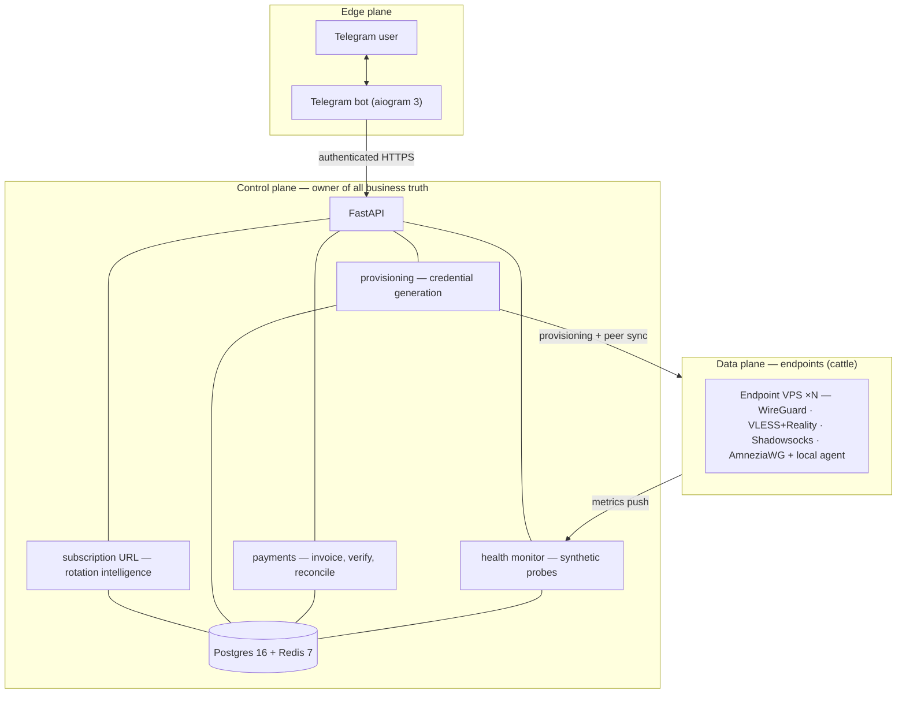

# Architecture

A readable, sanitized overview of how Sirin is put together. Operational details — live
addresses, provisioning internals, capacity — are intentionally omitted.

## Three planes

Sirin separates concerns into three planes that only ever talk to each other through
narrow, well-defined channels.

## Inter-plane rules

- **Edge → Control:** authenticated HTTPS REST.
- **Control → Endpoints:** configuration management for provisioning; an HTTPS pull for
  runtime peer sync. Endpoints fetch their own peer list; they never make policy.
- **Endpoints → Control:** HTTPS push of anonymous health metrics only.
- **Never:** an endpoint talking to Telegram, talking to a user directly, or holding any
  knowledge of billing.

## Data flow — first-time user

1. User messages the bot.
2. Bot walks them through a language picker → plan picker → payment (crypto invoice or
   Telegram Stars).
3. The payment is verified (HMAC on the provider webhook) and the subscription is activated.
4. The provisioning service generates a subscription token and per-protocol credentials
   across the plan's endpoint pool, encrypts them, and writes them. Endpoints pick up the
   new peer on their next sync.
5. The bot returns the subscription URL plus a one-shot QR for the first client install.
6. The user's client installs the subscription URL and begins polling it on its own cadence.

## Data flow — ongoing ranking & refresh

1. The client polls the subscription URL.
2. The service derives the caller's region (country-level, never stored as a raw address),
   looks up recent health for that region, and returns configs ordered by what is currently
   healthy — dropping anything blocked or draining.
3. A health-monitor worker independently runs synthetic probes against every
   (endpoint, protocol) pair on a short cadence.
4. Those signals drive endpoint state transitions and the protocol ordering returned per
   region — so the *list* is re-ranked server-side, with no re-import. If the available set
   changes, the bot notifies the user.

> Fully automatic, mid-session protocol *failover* (switching for the user without a manual
> tap) is a roadmap item that ships with the dedicated Sirin client app. Today the server
> keeps the list ranked and fresh; the user makes the final one-tap switch in a standard
> third-party client.

## Hard rules (the load-bearing ones)

- **No PII.** The Telegram ID is the only user identifier. Every other field is a liability
  we decline to hold. *(see [privacy.md](./privacy.md))*
- **The subscription URL is the product.** Everything else scaffolds around it; users are
  never asked to manually re-import a config.
- **Short retention.** Raw health signals are deleted after 7 days; only anonymous
  aggregates are kept.
- **Encrypted at rest.** Credentials and subscription tokens are encrypted at the
  application layer with Fernet before they reach the database.
- **LLM output is untrusted input.** The support agent's first layer can suggest but never
  mutate; a deterministic second layer is the only path to a database write.

## Tech

| Component | Tech |
| --- | --- |
| Control plane | FastAPI · SQLAlchemy 2 async · Alembic |
| Database | PostgreSQL 16 |
| Cache / queue | Redis 7 |
| Bot | aiogram 3 |
| Endpoint agent | Python 3.12 + httpx, systemd-deployed |
| Support agent | small LLM, two-layer with a deterministic validator |
| Provisioning | Ansible |
| Payments | NOWPayments (crypto) + Telegram Stars |
| Encryption | Fernet (application layer) |
